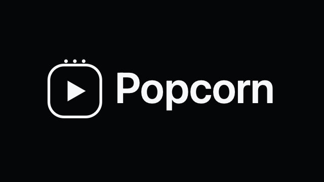

# Popcorn

<p align="center">
  
</p>

<p align="center">
  <strong>A polished Android TV and Fire TV client for Xtream-compatible live TV, movies, and series.</strong>
</p>

<p align="center">
  
  
  
  
</p>

Popcorn is a lean TV-first streaming app built for the couch: fast catalog browsing, big remote-friendly controls, rich channel artwork, and direct playback through Android's Media3 stack.

It is designed for personal Xtream-compatible subscriptions. The repository does not include providers, playlists, credentials, channels, movies, series, or any media content.

## Built With AI

This project is also an experiment in AI-native software development. The application was written entirely through AI assistance and prompts, without manually typing a single line of application code.

## Highlights

- Live TV browsing with categories, search, favorites, and last-channel memory.
- Fullscreen live playback with previous/next channel controls directly in the player.
- Movies and series catalogs with poster artwork, details, episode selection, and resume progress.
- Fire TV friendly launcher assets, banner, and leanback support.
- Local Room cache for catalogs, favorites, playback progress, and user library state.
- Media3/ExoPlayer playback with HLS support.
- A dark, glassy, TV-scale interface built with Jetpack Compose.

## Brand Assets

Popcorn ships with refreshed launcher and TV artwork for Android TV and Fire TV:

- Android TV banner: `app/src/main/res/drawable-nodpi/tv_banner.png`
- High-resolution banner copies: `app/src/main/res/mipmap-*/popcorn_tv_banner.png`
- Launcher icon: `app/src/main/res/mipmap-*/ic_launcher.png`
- Round launcher icon: `app/src/main/res/mipmap-*/ic_launcher_round.png`
- Source foreground artwork: `app/src/main/res/drawable/popcorn_logo_foreground.png`

## Tech Stack

- Kotlin
- Android TV / Fire TV
- Jetpack Compose and Material 3
- AndroidX TV Material
- Media3 ExoPlayer
- Room
- OkHttp
- Kotlin coroutines and serialization
- Gradle Kotlin DSL

## Requirements

- JDK 17
- Android SDK and Platform Tools
- An Android TV or Fire TV device with ADB debugging enabled
- Your own Xtream-compatible account

## Configuration

Popcorn no longer requires Xtream credentials at build time. Build and install the APK, then enter your Xtream base URL, username, and password on the first launch screen.

`.env.example` remains as local documentation for the expected values:

```env
XTREAM_BASE_URL=https://example.com:8080
XTREAM_USERNAME=username
XTREAM_PASSWORD=password
```

`.env` and `.env.*` files are intentionally ignored by Git. They are optional and are not read by the Android build.

## Build

```bash
./gradlew :app:assembleDebug
```

The APK is generated at:

```text
app/build/outputs/apk/debug/app-debug.apk
```

## Install On Fire TV

Connect to your Fire TV or Firestick over ADB:

```bash
export FIRESTICK_IP=192.168.1.50
adb connect "$FIRESTICK_IP:5555"
adb install -r app/build/outputs/apk/debug/app-debug.apk
```

The `-r` flag updates the app while preserving the local Room cache.

More detailed setup notes are available in [docs/deployment/firestick.md](docs/deployment/firestick.md).

## Test

```bash
./gradlew :app:testDebugUnitTest
```

## Project Status

Popcorn is a personal Android TV project focused on a smooth Fire TV experience. The current version is functional for live TV, movie catalogs, series catalogs, favorites, and playback progress.

## License

No license has been selected yet.
